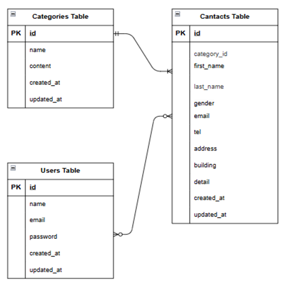

# アプリケーション名
 Contact Form

## 概要
お問い合わせフォームから送信された内容を保存し、管理画面で検索・詳細確認・削除ができるアプリです。

## 環境構築
・Dockerビルド
- git clone git@github.com:tanakami315/TEST-contact-form-.git
- docker-compose up -d --build

・Laravel環境構築
- docker-compose exec php bash
- composer install
- cp .env.example .env,
- .env ファイルの環境変数を適宜変更
- php artisan key:generate
- php artisan migrate
- php artisan db:seed

## URL
- お問い合わせ画面：http://localhost/
- ユーザー登録：http://localhost/register
- ユーザーログイン：http://localhost/login
- phpMyAdmin：http://localhost:8080/index.php

## 実行環境
- PHP 8.5.3
- Laravel Framework 8.83.8
- MariaDB 11.8.6
- nginx 1.21.1

## 使用技術
- Laravel Fortify
- Livewire
- Tailwind CSS
- Blade
- CSS

## ER図
